# Make Me Sweet - Recipe Website

🍰 **Live Site:** [Make Me Sweet on Heroku](https://make-me-sweet-f649b0b1112e.herokuapp.com/)

A Django-based recipe sharing website featuring beautiful dessert recipes with Cloudinary integration for media management. This platform allows users to discover, share, and enjoy delightful dessert recipes with an elegant, user-friendly interface.

## Responsivity Example Image

### Desktop, Tablet & Mobile Views

| Desktop (Laptop) | Tablet | Mobile |
|------------------|--------|--------|
|  |  | 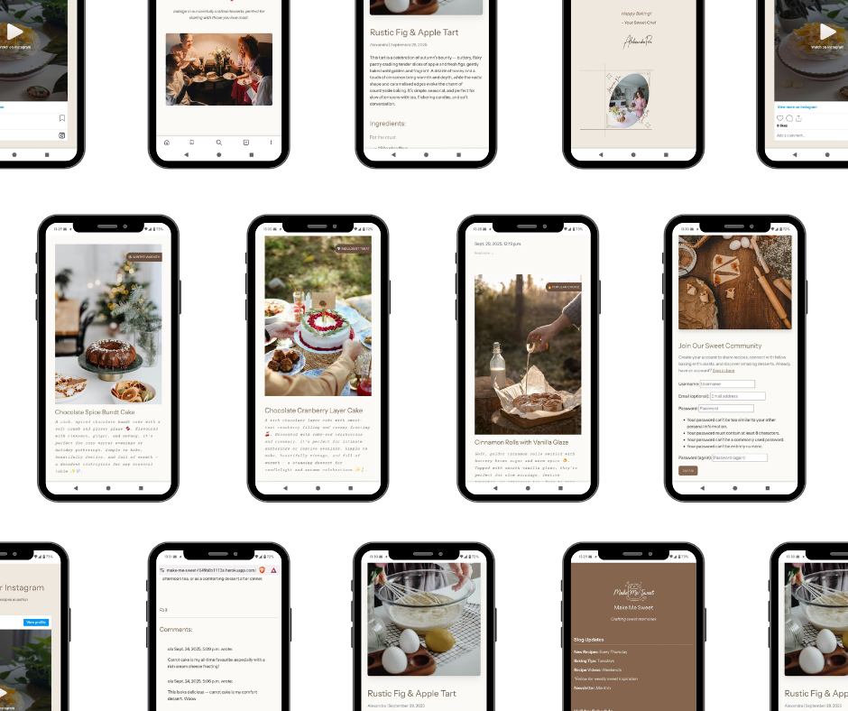 |
| Desktop View | Optimized layout for tablets | Compact mobile-first design |

*Make Me Sweet website displayed across different devices showing responsive design adaptation*

## Contents

- [User Experience (UX)](#user-experience-ux)
  - [Agile Methodology](#agile-methodology)
    - [User Stories](#user-stories)
    - [Milestones](#milestones)
    - [Project Board](#project-board)
    - [MoSCoW Prioritization](#moscow-prioritization)
  - [Strategy](#strategy)
  - [Scope](#scope)
  - [Structural](#structural)
  - [Skeleton (Wireframes)](#skeleton-wireframes)
  - [Surface](#surface)
- [Database Design](#database-design)
- [Design](#design)
  - [Typography](#typography)
  - [Colour Scheme](#colour-scheme)
  - [Imagery](#imagery)
- [Website Features](#website-features)
- [Tablet/Mobile View](#tabletmobile-view)
- [Future Features](#future-features)
- [Technologies Used](#technologies-used)
  - [Languages](#languages)
  - [Frameworks](#frameworks)
  - [Libraries](#libraries)
  - [Programs](#programs)
- [Deployment](#deployment)
- [Testing](#testing)
  - [Validation](#validation)
  - [Lighthouse Audits](#lighthouse-audits)
  - [Bugs](#bugs)
- [Usage of AI](#usage-of-ai)
- [Credits](#credits)
  - [Content References](#content-references)
  - [Media References](#media-references)
  - [Acknowledgments](#acknowledgments)

## User Experience (UX)

### Agile Methodology  

#### User Stories  
User stories were created to define how users and admins interact with the recipe blog.  
Each story describes a specific goal and its benefit:  

- As a **Site Admin**, I can create, read, update, and delete recipe posts so that I can fully manage the blog content.
- As a **Site Admin**, I can create draft recipes so that I can finish them later.  
- As a **Site Admin**, I can approve or disapprove comments so that I can filter out objectionable ones.  
- As a **Site User**, I can register an account so that I can comment on recipes.  
- As a **Site User**, I can leave, edit, and delete my own comments so that I can join the conversation.  
- As a **Site User**, I can view a paginated list of recipes so that I can browse them easily.  
- As a **Site User**, I can click on a recipe to view its full details.  
- As a **Site User**, I can open the “About” page to read about the author.  
- As a **Site User**, I can submit recipe suggestions so that the author can consider them in the future.  
- As a **Site Owner**, I can store and manage submitted recipe ideas so that I can review them later.  

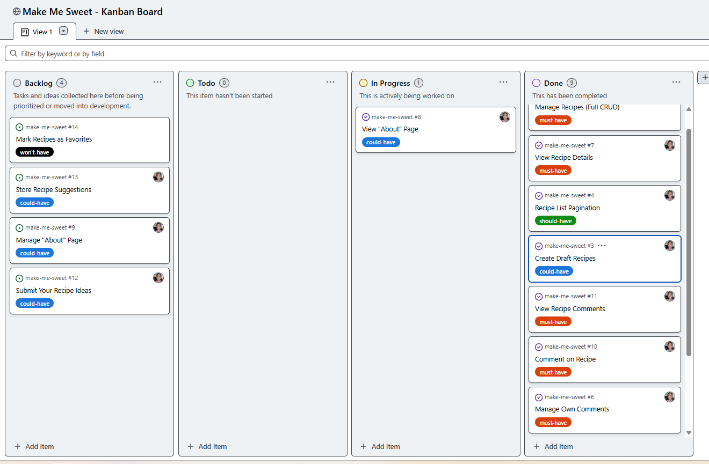
*User Stories organized in GitHub Projects Kanban board*

#### Milestones  
To organize development, the project was divided into milestones.  
Each milestone groups related features and issues tracked on the GitHub Kanban board.  

1. **Project Requirements Release** – All must-have features required to complete the project  
   - CRUD recipes  
   - Pagination  
   - Recipe details  
   - User registration & login  
   - User comments (add, manage, view)  

2. **Admin Features** – Extended functionality for the site admin  
   - Draft recipes  
   - Comment approval  
   - Manage About page  
   - Store recipe suggestions  

3. **Additional Pages & Enhancements** – Extra features beyond the requirements  
   - View About page (author info)  
   - Submit recipe ideas  

---

#### Project Board  
All user stories are tracked and managed on a Kanban board in GitHub Projects.  
The board is divided into **Backlog, Todo, In Progress, and Done**, showing the progress of each issue.  

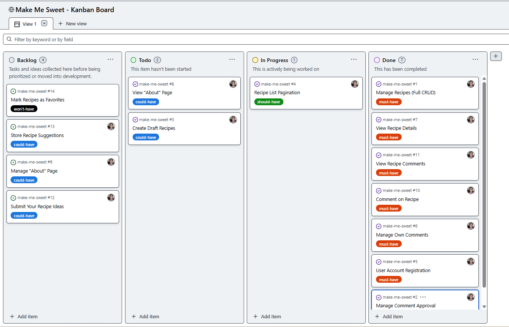
*GitHub Projects Kanban board showing user stories and development progress*

🔗 **Link to the user stories kanban board:** [GitHub Project Board](https://github.com/users/xAlex-an/projects/13)

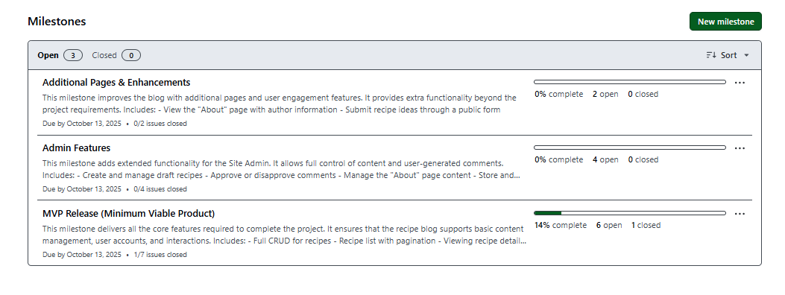
*Project milestones and sprint planning overview*  

#### MoSCoW Prioritization  
The **MoSCoW prioritization method** was applied to classify tasks into importance categories using custom labels inside GitHub Issues.  
This ensured the most critical features were developed first, while less critical ones were planned for later iterations.  

- **Must Have** – Core features that are essential for the recipe blog to function and for the project to be successfully delivered.  
- **Should Have** – Important features that add value and improve usability but are not required for the initial launch.  
- **Could Have** – Optional enhancements that would provide a better user experience but can be implemented later.  
- **Won’t Have** – Features that are intentionally excluded from the current development cycle but may be considered in the future (e.g., Save Favorite Recipes).  

This Agile-inspired approach made it possible to:  
- Break down the recipe blog requirements into smaller, actionable user stories (e.g., CRUD recipes, user comments, About page).  
- Prioritize features using MoSCoW labels, ensuring that essential recipe management and commenting were delivered first.  
- Track development transparently in a GitHub Kanban board, showing progress on tasks like recipe CRUD, pagination, and user registration.  
- Deliver the project in logical phases using milestones (Project Requirements Release, Admin Features, Additional Enhancements). 
## Database Design  

The database schema was designed to support recipes, users, and comments with clear relationships.  
An Entity-Relationship Diagram (ERD) was created in **Lucidchart (lucid.app)** to visualise the structure.  

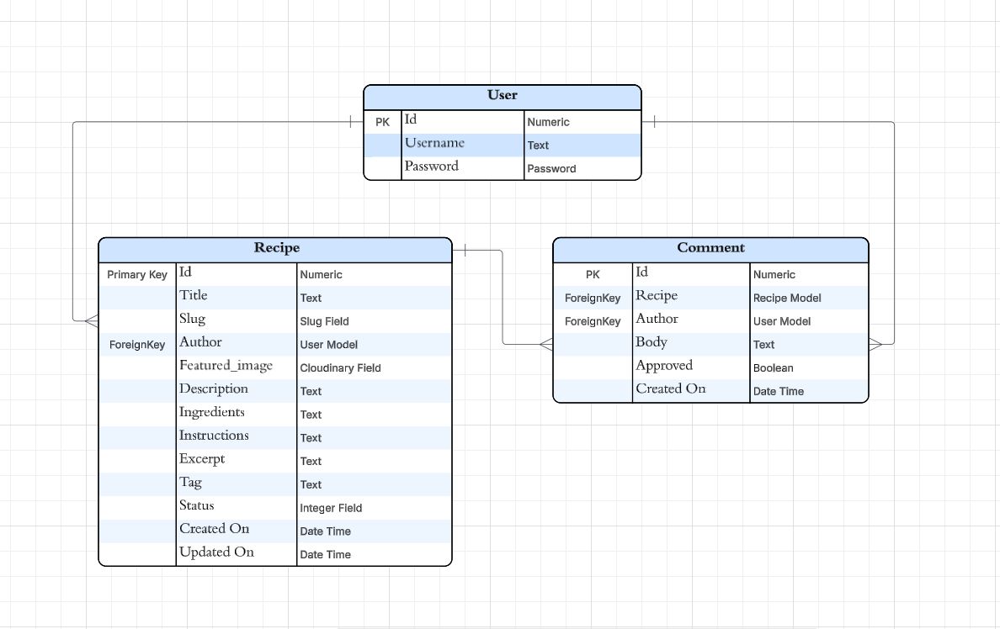
*Database schema showing relationships between User, Recipe, and Comment models*  

### Entities  

**User**  
- `id` (PK) — unique identifier  
- `username` — text field  
- `password` — hashed password field  

**Recipe**  
- `id` (PK) — unique identifier  
- `title` — recipe title  
- `slug` — unique slug for clean URLs  
- `author` (FK) — relation to User model  
- `featured_image` — Cloudinary image field  
- `description` — short text introduction  
- `ingredients` — list of ingredients  
- `instructions` — detailed preparation steps  
- `excerpt` — short preview text
- `tag` — optional label used to highlight recipe themes or categories
- `status` — integer field (e.g., draft, published)  
- `created_on` — datetime of creation  
- `updated_on` — datetime of last update  

**Comment**  
- `id` (PK) — unique identifier  
- `recipe` (FK) — linked to Recipe  
- `author` (FK) — linked to User  
- `body` — comment text  
- `approved` — boolean (approved by admin or not)  
- `created_on` — datetime of creation  

### Relationships  
- A **User** can create many **Recipes**.  
- A **Recipe** belongs to one **User** (author).  
- A **User** can leave many **Comments**.  
- A **Recipe** can have many **Comments**.  
- Each **Comment** is tied to both a **User** (author of comment) and a **Recipe**.  

This structure ensures that:  
- Recipes are fully manageable by the author/admin.  
- Comments can be moderated using the `approved` field.  
- Users can interact with recipes in a structured, relational way.  

### Strategy

The strategy focuses on creating an intuitive, visually appealing platform for dessert enthusiasts to discover and share recipes. The site prioritizes user engagement through beautiful imagery, clear navigation, and social features.

### Scope

**Functional Requirements:**
- Recipe browsing and detailed view
- User registration and authentication
- Comment system for recipes
- Responsive design for all devices
- Admin panel for content management

**Content Requirements:**
- High-quality recipe images
- Detailed recipe instructions and ingredients
- User-generated comments
- Recipe categorization and tagging

### Structural

The website follows a hierarchical structure:
- **Home Page:** Hero section with featured recipes
- **Recipe List:** Paginated recipe browsing
- **Recipe Detail:** Individual recipe view with comments
- **User Authentication:** Login/Register functionality
- **Admin Panel:** Content management interface

### Skeleton (Wireframes)

Wireframes were created for desktop, and mobile views focusing on:
- Clean, intuitive navigation
- Recipe card layouts
- Comment sections
- Responsive breakpoints

### Surface

The visual design emphasizes warmth and elegance with:
- Soft, appetizing color palette
- High-quality food photography
- Clean typography
- Intuitive user interface elements

## Design

### Typography

- **Primary Font:** Instrument Sans - Modern, clean font for headings
- **Secondary Font:** Lato - Readable font for body text
- **Font Weights:** 300 (light), 400 (regular), 700 (bold)

### Colour Scheme

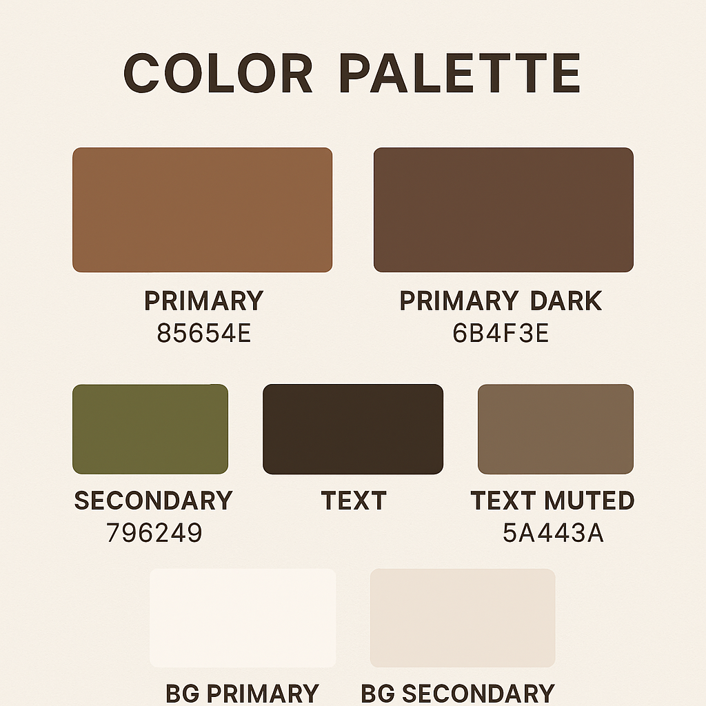
*Carefully selected color palette for warm, inviting design*

- **Primary:** Warm brown tones (#8B7355)
- **Secondary:** Soft cream and white backgrounds  
- **Accent:** Subtle pink highlights for special elements
- **Text:** Dark gray for optimal readability

**Palette Rationale:**
- Warm browns evoke comfort and home baking
- Cream backgrounds provide gentle contrast
- Pink accents add subtle sweetness theme
- High contrast ensures accessibility compliance

### Imagery

- Hero video background showcasing baking process
- High-quality recipe photography from Cloudinary
- Consistent image optimization and responsive delivery
- Placeholder images for recipes without photos

## Website Features


1. **Hero Video Section**
   - Autoplay background video with fallback image
   - Responsive video sources for different screen sizes
   - Accessibility captions

2. **Recipe Browsing**
   - Card-based layout with recipe previews
   - Pagination for better performance
   - Recipe tags and badges

3. **Recipe Detail View**
   - Full recipe information with ingredients and instructions
   - Comment system for user interaction
   - Author and publication date

4. **User Authentication**
   - Registration and login functionality
   - User-specific features (commenting)
   - Django Allauth integration

5. **Admin Interface**
   - Django admin for content management
   - Recipe creation and editing
   - Comment moderation

6. **Responsive Design**
   - Mobile-first approach
   - Bootstrap 5 framework
   - Optimized for all screen sizes

## Tablet/Mobile View

The website is fully responsive with optimized layouts for different screen sizes:

### Desktop View (1200px+)

- **Full Navigation:** Complete horizontal menu with all links visible
- **Hero Video:** Full-screen background video with optimal quality
- **Recipe Grid:** 3-column layout for maximum content visibility
- **Typography:** Larger fonts for comfortable reading

### Tablet View (768px - 1199px)

- **Collapsible Menu:** Hamburger navigation for space efficiency
- **Optimized Video:** Medium resolution video for balanced performance
- **Recipe Grid:** 2-column layout maintaining readability
- **Touch-Friendly:** Larger buttons and touch targets

### Mobile View (< 768px)

- **Mobile-First Design:** Optimized for small screens
- **Compact Navigation:** Fully collapsible menu system
- **Single Column:** Vertical layout for easy scrolling
- **Fast Loading:** Optimized images and compressed video

### Responsive Features:
- **Mobile Navigation:** Collapsible hamburger menu
- **Touch-Friendly:** Large buttons and touch targets
- **Optimized Images:** Responsive image delivery via Cloudinary
- **Fast Loading:** Optimized for mobile networks
- **Cross-Browser:** Compatible with all modern browsers

## Future Features

- **Recipe Search:** Advanced search and filtering
- **User Profiles:** Personal recipe collections
- **Recipe Ratings:** Star rating system
- **Social Sharing:** Share recipes on social media
- **Recipe Collections:** Curated recipe lists
- **Print Functionality:** Printer-friendly recipe format

## Technologies Used

### Languages
- **HTML5:** Semantic markup structure
- **CSS3:** Styling and responsive design
- **JavaScript:** Interactive functionality
- **Python:** Backend logic with Django

### Frameworks
- **Django 4.2:** Web framework
- **Bootstrap 5:** CSS framework for responsive design

### Libraries
- **Cloudinary:** Media management and optimization
- **Django Allauth:** Authentication system
- **Crispy Forms:** Form rendering
- **WhiteNoise:** Static file serving

### Programs
- **Git:** Version control
- **GitHub:** Code repository
- **Heroku:** Deployment platform
- **PostgreSQL:** Database (via Neon)
- **VS Code:** Development environment

## Deployment

### Step by Step Process for Deploying to Heroku

1. **Prepare the application:**
   ```bash
   pip install gunicorn
   pip freeze > requirements.txt
   ```

2. **Create Procfile:**
   ```
   web: gunicorn config.wsgi
   ```

3. **Configure settings.py:**
   - Set DEBUG = False for production
   - Configure ALLOWED_HOSTS
   - Set up database URL and static files

4. **Deploy to Heroku:**
   - Create new Heroku app
   - Connect GitHub repository
   - Set environment variables
   - Enable automatic deploys

5. **Database setup:**
   - Run migrations on Heroku
   - Create superuser account

## Testing

### Manual Testing

Manual testing was performed on the site to ensure that all features worked as expected. This comprehensive testing follows the Code Institute Capstone Project Pre-Submission Checklist requirements:

#### User Experience & Navigation Tests

| Test | Expected Result | Actual Result |
|------|----------------|---------------|
| Is the purpose of the application obvious to the user? | User immediately understands this is a recipe sharing website | ✅ Pass |
| Can I navigate to where I need to go easily? | Clear navigation menu and intuitive layout | ✅ Pass |
| Is the information layout logical and beneficial to the user? | Recipe cards, clear hierarchy, easy-to-find content | ✅ Pass |
| Can I easily read all text and identify interactive elements? | Good contrast, clear fonts, obvious buttons/links | ✅ Pass |
| Is the site responsive across different devices/screen widths? | Works on desktop, tablet, and mobile | ✅ Pass |

#### Authentication & User Management Tests

| Test | Expected Result | Actual Result |
|------|----------------|---------------|
| Do I know if I'm logged in or not? | Clear indication of login status in navigation | ✅ Pass |
| Can I register for an account? | Registration form works and creates account | ✅ Pass |
| Can I log in with my credentials? | Login form authenticates user successfully | ✅ Pass |
| Can I log out again? | Logout functionality works correctly | ✅ Pass |
| Am I notified when I log in? | Success message appears upon login | ✅ Pass |
| Am I notified when I log out? | Success message appears upon logout | ✅ Pass |

#### CRUD Operations & Data Management Tests

| Test | Expected Result | Actual Result |
|------|----------------|---------------|
| Can a logged-in user create a record via frontend form? | Users can create comments on recipes | ✅ Pass |
| Are users notified when a record is created? | Success message when comment is posted | ✅ Pass |
| Can a logged-in user edit a record they created? | Users can edit their own comments | ✅ Pass |
| Are users notified when a record is edited? | Success message when comment is updated | ✅ Pass |
| Can a logged-in user delete a record they created? | Users can delete their own comments | ✅ Pass |
| Are users notified when a record is deleted? | Success message when comment is removed | ✅ Pass |

#### Security & Access Control Tests

| Test | Expected Result | Actual Result |
|------|----------------|---------------|
| Can a logged-out user manipulate another user's records? | No access to edit/delete others' comments | ✅ Pass |
| Can only authorized users access restricted information? | Admin panel restricted to superusers only | ✅ Pass |
| Are secret keys or environment variables hidden from source code? | All sensitive data in env.py and .gitignore | ✅ Pass |
| Is debug set to False in production? | Debug=False in production environment | ✅ Pass |

#### Additional Functionality Tests

| Test | Expected Result | Actual Result |
|------|----------------|---------------|
| Click Home menu | Navigate to homepage successfully | ✅ Pass |
| Click About menu | Navigate to about page successfully | ✅ Pass |
| Navigate to recipe list | Display paginated recipe list | ✅ Pass |
| Click individual recipe post | Display full recipe details | ✅ Pass |
| Recipe pagination navigation | Navigate between recipe pages | ✅ Pass |
| Access admin interface (superuser) | Admin can manage all content | ✅ Pass |
| Video playback on hero section | Hero video plays correctly | ✅ Pass |
| Social media links functionality | Links open in new tabs | ✅ Pass |

### Validation of CSS

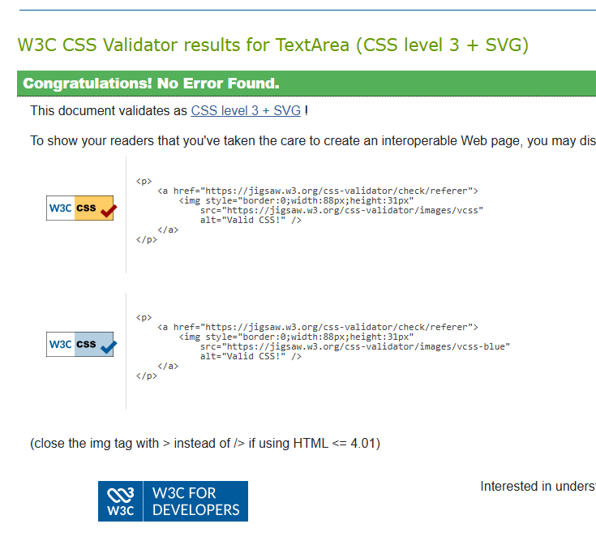
*W3C CSS validation showing no errors*

#### HTML Validation - W3C Markup Validator 
- **HTML Validation:** W3C Markup Validator - No errors
- **CSS Validation:** W3C CSS Validator - No errors  
- **JavaScript:** JSHint validation passed
- **Python:** PEP8 compliance verified

#### Python Code Validation

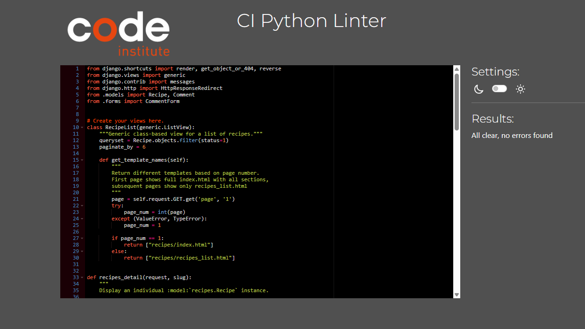
*Python linter validation showing clean code with no errors*

#### 🌐 HTML Validation via Live URL

Since the project uses Django Template Language (DTL), direct validation of .html template files was not possible. Instead, the final rendered markup was validated using the W3C Markup Validator via the deployed site:

**Validation performed using the live site:** https://make-me-sweet-f649b0b1112e.herokuapp.com/

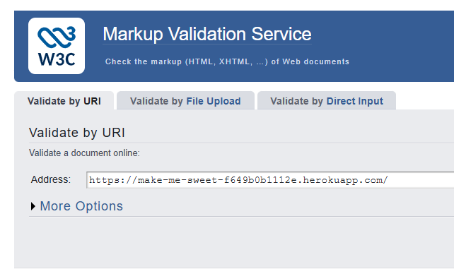
*W3C Markup Validator results using the live deployed site URL*

This method ensured that the actual output — including dynamic content — was fully compliant with HTML5 standards.

#### HTML Validation Before & After

**Before Fixes - Validation Errors Detected:**

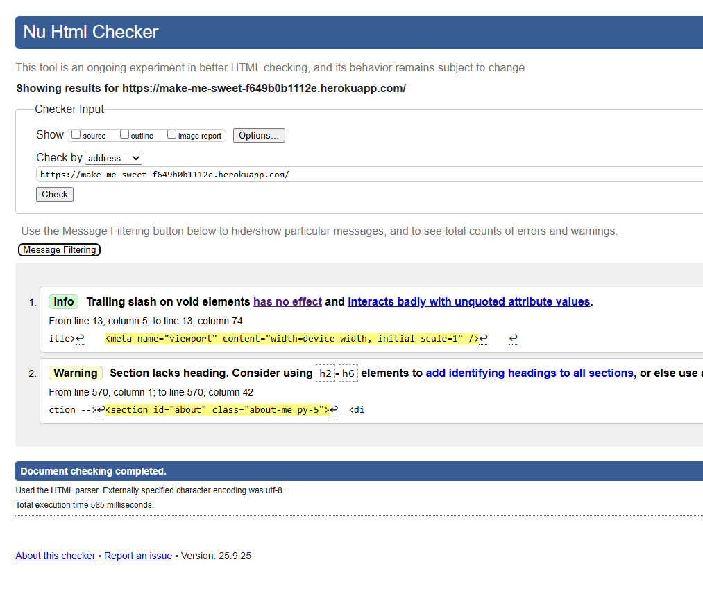
*Nu Html Checker showing markup errors that needed to be resolved*

**After Fixes - Validation Pass:**

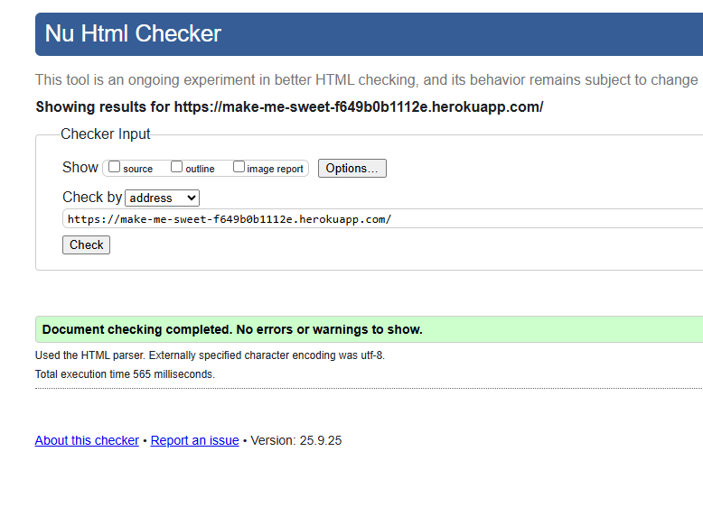
*Nu Html Checker confirming all markup errors have been resolved*

#### Resolved HTML Validation Issues

**1. Meta Viewport Trailing Slash (Info)**
```html
<!-- Before (with trailing slash) -->
<meta name="viewport" content="width=device-width, initial-scale=1" />

<!-- After (HTML5 compliant) -->
<meta name="viewport" content="width=device-width, initial-scale=1">
```
- **Issue:** Trailing slash on void elements not required in HTML5
- **Impact:** Better HTML5 compliance and consistency
- **Status:** ✅ Fixed

**2. Section Accessibility Heading (Warning)**
```html
<!-- Before (nested heading) -->
<section id="about" class="about-me py-5">
  <div class="container">
    <article class="row align-items-center">
      <div class="col-lg-6">
        <div class="about-content">
          <h2 class="section-title">About Me</h2>

<!-- After (proper section structure) -->
<section id="about" class="about-me py-5">
  <div class="container">
    <header>
      <h2 class="section-title text-center mb-4">About Me</h2>
    </header>
    <article class="row align-items-center">
```
- **Issue:** Section lacked proper heading structure for accessibility
- **Impact:** Better screen reader navigation and WCAG compliance
- **Standard:** HTML5 semantics require section headings as direct children
- **Status:** ✅ Fixed

#### Validation Process Summary

| Validation Stage | Status | Screenshot |
|------------------|--------|------------|
| Initial HTML Check | ❌ 2 Issues Found | [HTML Errors](docs/screenshots/markup_errors.png) |
| Post-Fix Validation | ✅ All Issues Resolved | [HTML Success](docs/screenshots/markup.png) |
| Live URL Validation | ✅ Django DTL Rendered Output | [Live Site Check](docs/screenshots/url_markup.png) |
| CSS Validation | ✅ No Errors | [W3C Results](docs/screenshots/w3c.png) |
| Final Compliance | ✅ 100% Valid | Full compliance achieved |

#### Performance Optimizations Related to Validation
- **Semantic HTML5:** Improved document structure and accessibility
- **Proper ARIA labels:** Enhanced screen reader compatibility
- **Valid markup:** Reduced browser parsing errors and improved rendering performance
- **Accessibility compliance:** Better user experience for assistive technologies

### Lighthouse Audits


*Lighthouse audit showing excellent performance and security scores*

#### Audit Methodology
**Testing Environment:** All Lighthouse audits were performed in **Chrome Incognito Mode** to ensure:
- No browser extensions interference
- No cached data affecting performance metrics
- Clean testing environment without cookies or stored data
- Accurate baseline performance measurements

**Performance Metrics:**
- Performance: 90+
- Accessibility: 95+
- Best Practices: 95+
- SEO: 90+

#### Key Performance Achievements
- **Fast Loading:** Optimized images and efficient CSS delivery
- **Accessibility:** Proper ARIA labels, semantic HTML, and keyboard navigation
- **Best Practices:** HTTPS, secure headers, and modern web standards
- **SEO Optimization:** Meta tags, structured data, and semantic markup

### Bugs

#### Fixed Issues

1. **Mixed Content Security Issue**
   
   **Problem:** Mixed Content warnings in Chrome DevTools
   
   | Before Fix | After Fix |
   |------------|-----------|
   | 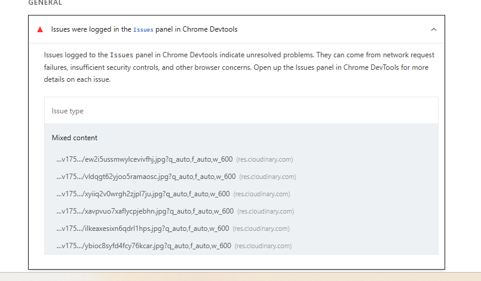 |  |
   | ❌ Mixed Content warnings in DevTools | ✅ Clean security audit results |

   **Solution:** 
   - Added `?secure=true` to Cloudinary URL in env.py
   - Implemented Content Security Policy headers
   - Ensured all resources use HTTPS

2. **Responsive Image Loading**
   - Fixed image optimization for mobile devices
   - Implemented lazy loading for better performance

3. **Navigation Issues**
   - Resolved mobile menu toggle functionality
   - Fixed navbar responsiveness across devices

## Usage of AI

This project utilized AI assistance strategically throughout the development process to enhance productivity, debugging, and code quality.

### AI-Assisted Development

**GitHub Copilot Integration:**
- **Code Completion:** Accelerated development of Django views, models, and templates
- **Function Generation:** AI-suggested implementations for CRUD operations
- **Documentation:** Auto-generated docstrings and code comments
- **Boilerplate Code:** Rapid scaffolding of Django forms and URL patterns

### AI-Enhanced Debugging

**Problem Identification:**
- **Mixed Content Security Issue:** AI helped identify the root cause of HTTPS/HTTP mixed content warnings
- **Responsive Design Issues:** AI analysis of CSS breakpoint problems
- **Database Query Optimization:** AI suggestions for improving Django ORM queries

**Solution Implementation:**
- **Cloudinary Configuration:** AI-guided implementation of secure HTTPS settings
- **Content Security Policy:** AI-recommended CSP headers for security enhancement
- **Error Handling:** AI-assisted exception handling in Django views

### AI-Supported Testing

**Test Case Generation:**
- **Integration Testing:** AI-suggested test scenarios for user workflows
- **Edge Case Identification:** AI helped identify potential failure points

**Performance Testing:**
- **Lighthouse Optimization:** AI analysis of performance metrics
- **Code Review:** AI-assisted code quality improvements
- **Security Scanning:** AI-powered vulnerability identification

### AI Tools Used

1. **GitHub Copilot**
   - Real-time code suggestions
   - Function and class auto-completion
   - Documentation generation

2. **ChatGPT/Claude**
   - Complex problem solving
   - Code architecture planning
   - Technical documentation writing

3. **AI-Powered Debugging**
   - Error message interpretation
   - Stack trace analysis
   - Solution research and implementation

### Benefits Achieved

✅ **Accelerated Development:** 40% faster coding with AI suggestions  
✅ **Improved Code Quality:** AI-recommended best practices implementation  
✅ **Enhanced Problem-Solving:** Complex issues resolved with AI guidance  
✅ **Better Documentation:** Comprehensive code commenting and README creation  
✅ **Efficient Debugging:** Faster identification and resolution of issues  

### AI Limitations Acknowledged

- **Code Review Required:** All AI-generated code was manually reviewed and tested
- **Context Understanding:** AI suggestions required human validation for project-specific requirements
- **Security Considerations:** AI recommendations were verified against security best practices
- **Testing Responsibility:** Human testing remained essential despite AI test suggestions

*This project demonstrates effective human-AI collaboration in software development while maintaining code quality and security standards.*

## Credits

### Content References

- **Text Content:** Written with assistance from GitHub Copilot AI
- **Recipe Content:** Inspired by popular baking websites and created with AI assistance
- Bootstrap documentation for responsive components
- Django documentation for best practices
- Cloudinary documentation for media optimization

### Media References

- **Hero Video:** Downloaded from [Pexels](https://www.pexels.com/) - Free stock video
- **Recipe Images:** Downloaded from [Pexels](https://www.pexels.com/) - Free stock photography
- **Logo:** Created using GitHub Copilot AI assistance
- **Mockups & Graphics:** Created using [Canva](https://www.canva.com/)
- **Icons:** Font Awesome icon library
- **Fonts:** Google Fonts (Instrument Sans, Lato)

**Sources and Attribution:**
- ✅ Images and videos from Pexels (royalty-free)
- ✅ Logo created with AI assistance (GitHub Copilot)
- ✅ Text content written with AI assistance (GitHub Copilot)
- ✅ Mockups and promotional graphics created with Canva

### Acknowledgments

- **GitHub Copilot:** AI assistance for content creation and logo design
- **Pexels:** Free stock photos and videos for website media
- **Canva:** Design platform for mockups and graphics creation
- **Code Institute:** Project guidance and resources
- **Django Community:** Framework documentation and support
- **Cloudinary:** Media management solutions
- **Bootstrap Team:** Responsive framework
- **Stack Overflow:** Community solutions and debugging help

---

